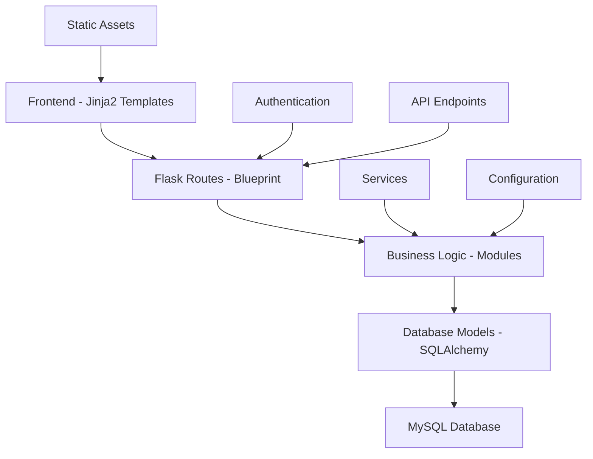
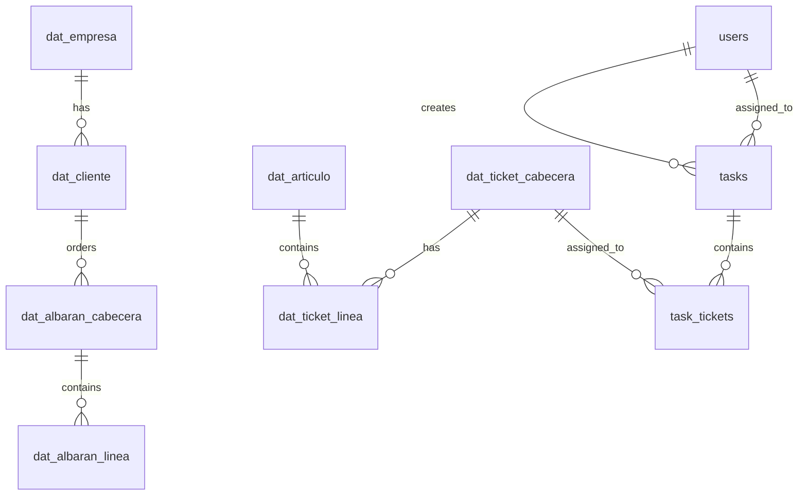
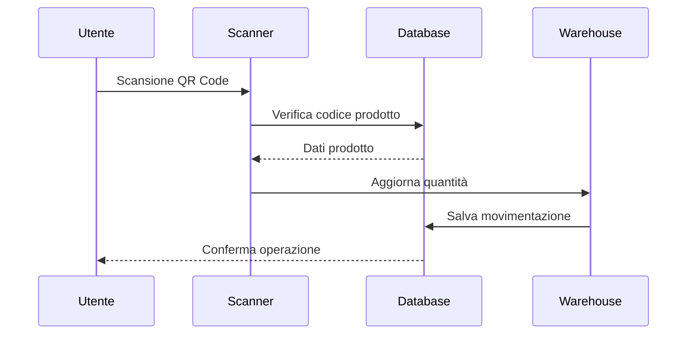
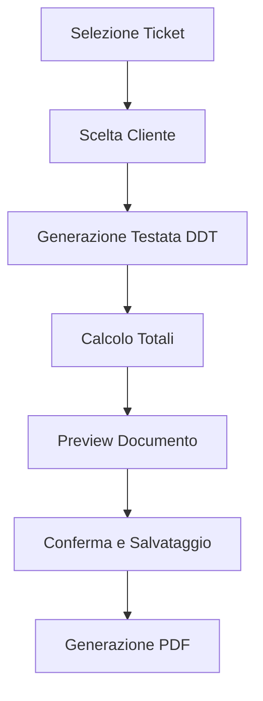

# 🏭 DBLogiX - Sistema di Gestione Magazzino e Tracciabilità


## 📋 Indice

- [Panoramica del Progetto](#-panoramica-del-progetto)
- [Architettura del Sistema](#️-architettura-del-sistema)
- [Tecnologie Utilizzate](#-tecnologie-utilizzate)
- [Struttura del Database](#-struttura-del-database)
- [Moduli e Funzionalità](#-moduli-e-funzionalità)
- [Installazione e Configurazione](#-installazione-e-configurazione)
- [API e Endpoint](#-api-e-endpoint)
- [Frontend e UI](#-frontend-e-ui)
- [Sicurezza e Autenticazione](#-sicurezza-e-autenticazione)
- [Logging e Monitoraggio](#-logging-e-monitoraggio)
- [Deployment](#-deployment)
- [Testing](#-testing)
- [Contributi](#-contributi)

## 🎯 Panoramica del Progetto

**DBLogiX** è una webapp completa per la gestione del magazzino, tracciabilità dei prodotti, e gestione dei documenti di trasporto (DDT) e fatturazione elettronica. Il sistema è progettato per integrarsi con bilance industriali e sistemi POS per la tracciabilità completa dei prodotti dal ricevimento alla vendita.

### 🎯 Obiettivi Principali
- **Tracciabilità Completa**: Dal ricevimento prodotti fino alla vendita finale
- **Gestione Magazzino**: Controllo stock, movimentazioni, scadenze
- **Automazione Processi**: Generazione automatica DDT e fatture
- **Task Management**: Sistema di gestione task per operatori
- **Integrazione Hardware**: Supporto per bilance e scanner QR/Barcode

### 🏢 Casi d'Uso
- Gestione magazzino per aziende alimentari
- Tracciabilità prodotti con QR Code
- Generazione automatica documenti fiscali
- Controllo qualità e scadenze prodotti
- Gestione clienti e fornitori

## 🏗️ Architettura del Sistema

### Struttura MVC Flask



### 🗂️ Struttura Directory

```
DBLogiX/
├── 📁 app/                     # Core applicazione Flask
│   ├── __init__.py
│   ├── auth.py                 # Autenticazione utenti
│   ├── config.py              # Configurazioni sistema
│   ├── config_manager.py      # Gestione configurazioni esterne
│   ├── forms.py               # Form WTF
│   └── models.py              # Modelli database SQLAlchemy
├── 📁 modules/                # Moduli funzionali
│   ├── admin.py               # Pannello amministrazione
│   ├── articles.py            # Gestione articoli
│   ├── clients.py             # Gestione clienti
│   ├── ddt.py                 # Documenti di trasporto
│   ├── fattura_pa.py          # Fatturazione elettronica PA
│   ├── sections.py            # Gestione sezioni magazzino
│   ├── tasks.py               # Sistema gestione task
│   └── warehouse.py           # Gestione magazzino
├── 📁 services/               # Servizi di supporto
│   ├── chat.py                # Sistema chat interno
│   ├── dblogix_service.py     # Servizi Windows
│   ├── main_service.py        # Servizi principali
│   └── utils.py               # Utility functions
├── 📁 templates/              # Template Jinja2
│   ├── base.html              # Template base
│   ├── 📁 admin/              # Template amministrazione
│   ├── 📁 articles/           # Template articoli
│   ├── 📁 auth/               # Template autenticazione
│   ├── 📁 clients/            # Template clienti
│   ├── 📁 ddt/                # Template DDT
│   ├── 📁 fattura_pa/         # Template fatturazione
│   ├── 📁 sections/           # Template sezioni
│   ├── 📁 tasks/              # Template task
│   └── 📁 warehouse/          # Template magazzino
├── 📁 static/                 # Asset statici
│   ├── 📁 css/                # Fogli di stile
│   ├── 📁 js/                 # JavaScript
│   └── 📁 uploads/            # File caricati
├── 📁 migrations/             # Migrazioni database
├── 📁 logs/                   # File di log
├── 📁 scripts/                # Script utility
└── 📁 Backup/                 # Backup sistema
```

## 🛠️ Tecnologie Utilizzate

### Backend
| Tecnologia | Versione | Utilizzo |
|------------|----------|----------|
| **Python** | 3.8+ | Linguaggio principale |
| **Flask** | 2.3.3 | Framework web |
| **SQLAlchemy** | 2.0.23 | ORM Database |
| **Flask-Login** | 0.6.3 | Gestione sessioni |
| **Flask-WTF** | 1.2.1 | Form validation |
| **PyMySQL** | 1.1.0 | Driver MySQL |
| **Werkzeug** | 2.3.7 | WSGI toolkit |

### Frontend
| Tecnologia | Utilizzo |
|------------|----------|
| **HTML5** | Markup semantic |
| **CSS3** | Styling responsivo |
| **JavaScript ES6** | Interattività |
| **Bootstrap 5** | Framework CSS |
| **Jinja2** | Template engine |
| **FontAwesome** | Icone |

### Database
| Componente | Dettaglio |
|------------|-----------|
| **MySQL** | 8.0+ |
| **Charset** | UTF-8 |
| **Engine** | InnoDB |
| **Connessioni** | Pool connection |

### Librerie Specializzate
| Libreria | Versione | Funzione |
|----------|----------|----------|
| **ReportLab** | 4.4.0 | Generazione PDF |
| **QRCode** | 8.2 | Generazione QR Code |
| **Cryptography** | 41.0.5 | Crittografia |
| **Flask-CORS** | 4.0.0 | Cross-Origin Resource Sharing |

## 🗄️ Struttura del Database

### Tabelle Principali

#### 🏢 Gestione Azienda
```sql
-- Tabella aziende
dat_empresa (
    IdEmpresa INT PRIMARY KEY,
    NombreEmpresa VARCHAR(100),
    CIF_VAT VARCHAR(50),
    Direccion VARCHAR(200),
    Telefono1 VARCHAR(20),
    -- ... altri campi aziendali
)
```

#### 👥 Gestione Clienti
```sql
-- Tabella clienti
dat_cliente (
    IdCliente INT PRIMARY KEY,
    IdEmpresa INT,
    Nombre VARCHAR(100),
    Direccion VARCHAR(200),
    CodPostal VARCHAR(10),
    Poblacion VARCHAR(100),
    DNI VARCHAR(20),
    Email VARCHAR(100),
    Telefono1 VARCHAR(20),
    -- ... altri campi cliente
)
```

#### 📦 Gestione Prodotti
```sql
-- Tabella articoli/prodotti
dat_articulo (
    IdArticulo INT PRIMARY KEY,
    Descripcion VARCHAR(100),
    PrecioConIVA DECIMAL(13,3),
    EANScanner VARCHAR(50),
    IdFamilia INT,
    IdSubFamilia INT,
    IdIva INT,
    StockActual FLOAT,
    -- ... altri campi prodotto
)
```

#### 🎫 Sistema Ticketing
```sql
-- Testata ticket
dat_ticket_cabecera (
    IdTicket INT PRIMARY KEY,
    IdEmpresa INT DEFAULT 1,
    NumTicket INT,
    Fecha DATETIME,
    CodigoBarras VARCHAR(50),
    NumLineas INT,
    Enviado INT DEFAULT 0  -- Status: 0=Giacenza, 1=Processato, 4=Scaduto
)

-- Righe ticket
dat_ticket_linea (
    IdLineaTicket INT,
    IdTicket BIGINT,
    IdArticulo INT,
    Descripcion VARCHAR(100),
    Peso DECIMAL(15,3),
    FechaCaducidad DATETIME,
    comportamiento INT DEFAULT 0  -- 0=unità, 1=kg
    -- Chiave composta primaria
)
```

#### 📋 Sistema Task
```sql
-- Task management
tasks (
    id_task INT PRIMARY KEY,
    task_number VARCHAR(20) UNIQUE,
    title VARCHAR(200),
    description TEXT,
    status VARCHAR(20) DEFAULT 'pending',
    created_by INT,
    assigned_to INT,
    deadline DATETIME,
    priority VARCHAR(10) DEFAULT 'medium',
    total_tickets INT DEFAULT 0,
    completed_tickets INT DEFAULT 0
)

-- Associazione task-ticket
task_tickets (
    id INT PRIMARY KEY,
    task_id INT,
    ticket_id INT,
    status VARCHAR(20) DEFAULT 'pending',
    total_items INT DEFAULT 0,
    scanned_items INT DEFAULT 0
)
```

#### 📄 Documenti di Trasporto (DDT)
```sql
-- Testata DDT/Albarán
dat_albaran_cabecera (
    IdAlbaran BIGINT PRIMARY KEY,
    NumAlbaran BIGINT,
    IdEmpresa INT,
    IdCliente INT,
    NombreCliente VARCHAR(50),
    Fecha DATETIME,
    ImporteTotal FLOAT(15,3),
    NumLineas SMALLINT,
    Enviado BOOLEAN DEFAULT 0
)

-- Righe DDT/Albarán
dat_albaran_linea (
    IdLineaAlbaran INT,
    IdAlbaran BIGINT,
    IdArticulo INT,
    Descripcion VARCHAR(100),
    Peso FLOAT(15,3),
    Precio FLOAT(15,3),
    Importe FLOAT(15,3)
    -- Chiave composta primaria
)
```

#### 👤 Gestione Utenti
```sql
-- Utenti sistema
users (
    id INT PRIMARY KEY,
    username VARCHAR(64) UNIQUE,
    email VARCHAR(120) UNIQUE,
    password_hash VARCHAR(128),
    is_admin BOOLEAN DEFAULT FALSE,
    screen_task BOOLEAN DEFAULT FALSE,
    is_active BOOLEAN DEFAULT TRUE,
    created_at DATETIME
)

-- Log scansioni
scan_log (
    id INT PRIMARY KEY,
    user_id INT,
    ticket_id INT,
    action VARCHAR(20),  -- 'view', 'scan', 'checkout'
    timestamp DATETIME,
    raw_code VARCHAR(50),
    product_code INT,
    scan_date VARCHAR(20),
    scan_time VARCHAR(20)
)
```

### Relazioni Database



## 🧩 Moduli e Funzionalità

### 1. 🏠 Modulo Admin (`modules/admin.py`)
**Funzionalità**: Pannello di controllo amministrativo completo

#### Features:
- **Dashboard Statistiche**: Visualizzazione metriche sistema
- **Gestione Utenti**: CRUD utenti, ruoli, permessi
- **Configurazione Sistema**: Impostazioni globali
- **Gestione Database**: Configurazione connessione DB
- **Log Monitoring**: Visualizzazione log di sistema
- **Backup/Restore**: Gestione backup automatici

#### Endpoint Principali:
```python
/admin/                        # Dashboard principale
/admin/users                   # Gestione utenti
/admin/config                  # Configurazione sistema
/admin/stats                   # Statistiche avanzate
/admin/db_config              # Configurazione database
/admin/logs                   # Visualizzazione log
```

### 2. 📦 Modulo Warehouse (`modules/warehouse.py`)
**Funzionalità**: Gestione completa magazzino e tracciabilità

#### Features:
- **Scanner QR/Barcode**: Scansione prodotti con validazione
- **Gestione Ticket**: Visualizzazione e processamento ordini
- **Tracciabilità**: Storico movimentazioni prodotti
- **Controllo Scadenze**: Alert prodotti in scadenza
- **Checkout Automatico**: Processamento ordini con QR

#### Componenti UI:
```javascript
// Scanner Interface
scanner.html - Interfaccia scansione QR/Barcode
tickets.html - Lista ticket magazzino
ticket_detail.html - Dettaglio singolo ticket
generate_ddt_step.html - Generazione DDT da ticket
```

#### Workflow Scansione:


### 3. 📝 Modulo Tasks (`modules/tasks.py`)
**Funzionalità**: Sistema gestione task e workflow

#### Features:
- **Creazione Task**: Assegnazione compiti a operatori
- **Workflow Management**: Stati task (pending, in_progress, completed)
- **Progress Tracking**: Monitoraggio avanzamento
- **Notifiche Real-time**: Alert completamento task
- **Reporting**: Report produttività e performance

#### Stati Task:
| Stato | Descrizione |
|-------|-------------|
| `pending` | Task creato, in attesa assegnazione |
| `assigned` | Task assegnato a operatore |
| `in_progress` | Task in esecuzione |
| `completed` | Task completato |

#### Dashboard Task:
```javascript
// Admin Dashboard
admin_dashboard.html - Panoramica task admin
user_dashboard.html - Dashboard operatore
task_screen.html - Schermo dedicato task
create_task.html - Creazione nuovo task
edit_task.html - Modifica task esistente
```

### 4. 📄 Modulo DDT (`modules/ddt.py`)
**Funzionalità**: Gestione Documenti di Trasporto

#### Features:
- **Generazione DDT**: Creazione automatica da ticket
- **Selezione Clienti**: Interfaccia scelta destinatario
- **Preview Documenti**: Anteprima prima stampa
- **Esportazione PDF**: Generazione documento finale
- **Storico DDT**: Archivio documenti generati

#### Workflow DDT:


### 5. 💰 Modulo Fattura PA (`modules/fattura_pa.py`)
**Funzionalità**: Fatturazione Elettronica Pubblica Amministrazione

#### Features:
- **Generazione XML**: Formato standard FatturaPA
- **Validazione Dati**: Controllo conformità PA
- **Gestione CIG/CUP**: Codici identificativi gara
- **Firma Digitale**: Supporto firma qualificata
- **Invio SDI**: Integrazione Sistema Interscambio

### 6. 👥 Modulo Clients (`modules/clients.py`)
**Funzionalità**: Gestione clienti e fornitori

#### Features:
- **Anagrafica Completa**: Dati fiscali e commerciali
- **Classificazione Clienti**: Categorizzazione per tipo
- **Storico Ordini**: Visualizzazione acquisti precedenti
- **Gestione Crediti**: Controllo saldo clienti
- **Esportazione Dati**: Export per sistemi esterni

### 7. 🏷️ Modulo Articles (`modules/articles.py`)
**Funzionalità**: Gestione articoli e prodotti

#### Features:
- **Catalogo Prodotti**: Database completo articoli
- **Gestione Prezzi**: Listini e scontistiche
- **Controllo Stock**: Monitoraggio giacenze
- **Codici EAN**: Gestione barcode/QR code
- **Categorizzazione**: Organizzazione per famiglie/sezioni

### 8. 🏬 Modulo Sections (`modules/sections.py`)
**Funzionalità**: Gestione sezioni magazzino

#### Features:
- **Organizzazione Spazi**: Mapping aree magazzino
- **Assegnazione Prodotti**: Posizionamento articoli
- **Visualizzazione Grafica**: Mappe interattive sezioni
- **Ottimizzazione Layout**: Suggerimenti posizionamento

### 9. 💬 Servizio Chat (`services/chat.py`)
**Funzionalità**: Sistema comunicazione interno

#### Features:
- **Chat Real-time**: Messaggistica istantanea
- **Stanze Multiple**: Canali tematici
- **Notifiche**: Alert nuovi messaggi
- **Cronologia**: Storico conversazioni
- **Integrazione Task**: Chat collegata a task specifici

## ⚙️ Installazione e Configurazione

### Prerequisiti Sistema
```bash
# Sistema Operativo
Windows 10/11 o Linux Ubuntu 18.04+

# Python
Python 3.8 - 3.11 (testato)

# Database
MySQL 8.0+ o MariaDB 10.5+

# Hardware Raccomandato
RAM: 4GB+ (8GB+ consigliati)
CPU: 2+ cores
Disco: 10GB+ spazio libero
```

### Installazione

#### 1. Clone Repository
```bash
git clone https://github.com/your-org/DBLogiX.git
cd DBLogiX
```

#### 2. Ambiente Virtuale
```bash
# Creazione virtual environment
python -m venv venv

# Attivazione
# Windows
venv\Scripts\activate
# Linux/Mac
source venv/bin/activate
```

#### 3. Dipendenze
```bash
# Installazione requirements
pip install -r requirements.txt

# Verifica installazione
pip list
```

#### 4. Configurazione Database
```python
# app/config.py
REMOTE_DB_CONFIG = {
    'host': '192.168.1.32',           # IP server MySQL
    'user': 'dblogix_user',           # Username database
    'password': 'secure_password',    # Password database
    'database': 'sys_datos',          # Nome database
    'port': 3306,                     # Porta MySQL
    'charset': 'utf8',                # Charset
}
```

#### 5. Variabili Ambiente
```bash
# .env file
SECRET_KEY=your-secret-key-here
FLASK_DEBUG=False
FLASK_HOST=0.0.0.0
FLASK_PORT=5000
DB_HOST=192.168.1.32
DB_USER=dblogix_user
DB_PASSWORD=secure_password
DB_NAME=sys_datos
```

#### 6. Inizializzazione Database
```bash
# Creazione tabelle
python main.py

# O utilizzo Flask-Migrate
flask db upgrade
```

#### 7. Primo Avvio
```bash
# Avvio applicazione
python main.py

# Oppure modalità development
flask run --debug
```

### Configurazione Avanzata

#### Config Manager Esterno
Il sistema supporta configurazioni esterne tramite `config_manager.py`:

```python
# Configurazioni supportate
- Database connection
- Company settings  
- System parameters
- Chat configuration
- Client management
- DDT settings
- Invoice settings
```

#### Backup Automatico
```python
# Configurazione backup in config.py
BACKUP_CONFIG = {
    'enabled': True,
    'interval_hours': 24,
    'retention_days': 30,
    'backup_path': './Backup/'
}
```

## 🌐 API e Endpoint

### Autenticazione
```python
POST /auth/login          # Login utente
POST /auth/logout         # Logout utente
GET  /auth/register       # Registrazione (admin only)
```

### Warehouse Management
```python
GET  /warehouse/                    # Dashboard magazzino
GET  /warehouse/scanner            # Interfaccia scanner
POST /warehouse/scan               # Processamento scansione
GET  /warehouse/tickets            # Lista ticket
GET  /warehouse/ticket/<id>        # Dettaglio ticket
POST /warehouse/checkout           # Checkout prodotti
```

### Task Management  
```python
GET  /tasks/                       # Dashboard task
POST /tasks/create                 # Creazione task
GET  /tasks/view/<id>             # Visualizzazione task
PUT  /tasks/edit/<id>             # Modifica task
POST /tasks/assign                # Assegnazione task
GET  /tasks/notifications         # Notifiche task
```

### DDT Management
```python
GET  /ddt/                        # Lista DDT
POST /ddt/generate                # Generazione DDT
GET  /ddt/preview/<id>           # Anteprima DDT
GET  /ddt/detail/<id>            # Dettaglio DDT
POST /ddt/select_client          # Selezione cliente
POST /ddt/select_tickets         # Selezione ticket
```

### Client Management
```python
GET  /clients/                    # Lista clienti
POST /clients/create              # Creazione cliente
GET  /clients/edit/<id>          # Modifica cliente
DELETE /clients/delete/<id>      # Eliminazione cliente
GET  /clients/search             # Ricerca clienti
```

### Articles Management
```python
GET  /articles/                   # Catalogo articoli
POST /articles/create             # Creazione articolo
PUT  /articles/edit/<id>         # Modifica articolo
DELETE /articles/delete/<id>     # Eliminazione articolo
GET  /articles/search            # Ricerca articoli
POST /articles/import            # Importazione massiva
```

### Admin Panel
```python
GET  /admin/                      # Dashboard admin
GET  /admin/users                 # Gestione utenti
POST /admin/users/create          # Creazione utente
GET  /admin/config               # Configurazioni sistema
POST /admin/config/update        # Aggiornamento config
GET  /admin/stats                # Statistiche sistema
GET  /admin/logs                 # Visualizzazione log
```

### Utility API
```python
GET  /api/scan_network           # Scansione rete per dispositivi
POST /api/set_db_ip             # Impostazione IP database
POST /api/test_db_connection    # Test connessione database
GET  /uploads/<filename>        # Accesso file caricati
```

### WebSocket Endpoints
```javascript
// Chat real-time
/chat/messages                   // Messaggi chat
/chat/notifications             // Notifiche istantanee

// Task notifications
/tasks/status_updates           // Aggiornamenti stato task
/tasks/progress_updates         // Aggiornamenti progresso
```

## 🎨 Frontend e UI

### Framework e Librerie
```html
<!-- CSS Framework -->
<link href="https://cdn.jsdelivr.net/npm/bootstrap@5.3.0/dist/css/bootstrap.min.css">
<link href="https://cdnjs.cloudflare.com/ajax/libs/font-awesome/6.0.0/css/all.min.css">

<!-- JavaScript Libraries -->
<script src="https://cdn.jsdelivr.net/npm/bootstrap@5.3.0/dist/js/bootstrap.bundle.min.js"></script>
<script src="https://code.jquery.com/jquery-3.6.0.min.js"></script>
```

### Struttura CSS
```css
/* File CSS principali */
static/css/
├── base.css              /* Stili base globali */
├── admin.css             /* Pannello amministrazione */
├── warehouse.css         /* Interfaccia magazzino */
├── tasks.css             /* Sistema task */
├── ddt.css               /* Documenti trasporto */
├── articles.css          /* Gestione articoli */
├── clients.css           /* Gestione clienti */
├── chat.css              /* Sistema chat */
└── shared-components.css /* Componenti riutilizzabili */
```

### JavaScript Modulare
```javascript
// File JavaScript principali
static/js/
├── main.js                    // Funzioni globali
├── shared-components.js       // Componenti condivisi
├── tasks.js                   // Logica task management
├── notifications.js           // Sistema notifiche
├── chat.js                    // Chat real-time
├── sidebar.js                 // Navigazione sidebar
├── responsive.js              // Responsive design
└── admin/                     // Script amministrazione
    ├── dashboard.js
    ├── users.js
    └── config.js
```

### Template Jinja2
```html
<!-- Template base -->
templates/base.html
├── Header navigation
├── Sidebar menu
├── Flash messages
├── Main content area
└── Footer

<!-- Template specializzati -->
templates/
├── warehouse/
│   ├── index.html           <!-- Dashboard magazzino -->
│   ├── scanner.html         <!-- Interfaccia scanner -->
│   └── tickets.html         <!-- Lista ticket -->
├── tasks/
│   ├── admin_dashboard.html <!-- Dashboard admin task -->
│   ├── user_dashboard.html  <!-- Dashboard utente -->
│   └── task_screen.html     <!-- Schermo dedicato task -->
└── admin/
    ├── dashboard/
    └── configurazioni/
```

### Responsive Design
```css
/* Breakpoints responsivi */
@media (max-width: 576px) { /* Mobile */ }
@media (max-width: 768px) { /* Tablet */ }
@media (max-width: 992px) { /* Desktop small */ }
@media (max-width: 1200px) { /* Desktop large */ }
```

### Componenti UI Personalizzati

#### Scanner Interface
```html
<!-- Scanner QR/Barcode -->
<div class="scanner-container">
    <video id="scanner-video"></video>
    <div class="scanner-overlay">
        <div class="scanner-frame"></div>
        <div class="scanner-info">
            <p>Inquadra il QR Code del prodotto</p>
        </div>
    </div>
</div>
```

#### Task Cards
```html
<!-- Card task con progress bar -->
<div class="task-card">
    <div class="task-header">
        <h5 class="task-title">{{ task.title }}</h5>
        <span class="task-priority badge">{{ task.priority }}</span>
    </div>
    <div class="task-progress">
        <div class="progress">
            <div class="progress-bar" style="width: {{ task.progress_percentage }}%"></div>
        </div>
        <small>{{ task.completed_tickets }}/{{ task.total_tickets }} completati</small>
    </div>
</div>
```

#### Notification System
```javascript
// Sistema notifiche toast
function showNotification(message, type = 'info', duration = 5000) {
    const toast = `
        <div class="toast align-items-center text-white bg-${type}" role="alert">
            <div class="d-flex">
                <div class="toast-body">${message}</div>
                <button type="button" class="btn-close" data-bs-dismiss="toast"></button>
            </div>
        </div>
    `;
    document.getElementById('toast-container').insertAdjacentHTML('beforeend', toast);
}
```

## 🔐 Sicurezza e Autenticazione

### Sistema Autenticazione
```python
# Flask-Login integration
from flask_login import LoginManager, login_required, current_user

# User authentication
class User(UserMixin, db.Model):
    id = db.Column(db.Integer, primary_key=True)
    username = db.Column(db.String(64), unique=True, nullable=False)
    email = db.Column(db.String(120), unique=True, nullable=False)
    password_hash = db.Column(db.String(128))
    is_admin = db.Column(db.Boolean, default=False)
    is_active = db.Column(db.Boolean, default=True)
```

### Livelli Autorizzazione
| Ruolo | Permessi |
|-------|----------|
| **Admin** | Accesso completo sistema, gestione utenti, configurazioni |
| **Manager** | Gestione task, visualizzazione report, creazione DDT |
| **Operator** | Scansione prodotti, completamento task assegnati |
| **Viewer** | Solo visualizzazione dati, report read-only |

### Protezione CSRF
```python
# CSRF Protection
from flask_wtf.csrf import CSRFProtect
csrf = CSRFProtect(app)

# Form protection
class TicketForm(FlaskForm):
    csrf_token = HiddenField()
    # ... altri campi
```

### Password Security
```python
# Password hashing con Werkzeug
from werkzeug.security import generate_password_hash, check_password_hash

def set_password(self, password):
    self.password_hash = generate_password_hash(password)

def check_password(self, password):
    return check_password_hash(self.password_hash, password)
```

### Session Management
```python
# Configurazione sessioni
app.config['PERMANENT_SESSION_LIFETIME'] = timedelta(hours=2)
app.config['SESSION_COOKIE_SECURE'] = True
app.config['SESSION_COOKIE_HTTPONLY'] = True
app.config['SESSION_COOKIE_SAMESITE'] = 'Lax'
```

### API Security
```python
# Rate limiting per API
from flask_limiter import Limiter

@app.route('/api/scan', methods=['POST'])
@login_required
@limiter.limit("100 per minute")
def api_scan():
    # API endpoint con limitazione rate
```

## 📊 Logging e Monitoraggio

### Sistema Logging
```python
# Configurazione logging
import logging
from logging.handlers import RotatingFileHandler

# Log files
logs/
├── dblogix.log          # Log applicazione principale
├── error.log            # Log errori sistema
├── scan.log             # Log scansioni prodotti
├── task.log             # Log operazioni task
└── security.log         # Log eventi sicurezza
```

### Livelli Log
```python
# Configurazione log levels
logging.basicConfig(
    level=logging.INFO,
    format='%(asctime)s - %(name)s - %(levelname)s - %(message)s',
    handlers=[
        RotatingFileHandler('logs/dblogix.log', maxBytes=10240, backupCount=5),
        logging.StreamHandler()
    ]
)
```

### Monitoraggio Prestazioni
```python
# Metriche sistema
- Tempo risposta API endpoints
- Numero scansioni per ora/giorno
- Task completati per operatore
- Errori database connection
- Utilizzo memoria e CPU
```

### Dashboard Monitoring
```html
<!-- Pannello monitoraggio admin -->
/admin/stats
├── Statistiche scansioni
├── Performance database
├── Utilizzo sistema
├── Log errori recenti
└── Metriche utenti attivi
```

## 🚀 Deployment

### Deployment Windows

#### 1. Servizio Windows
```python
# services/dblogix_service.py
import win32serviceutil
import win32service
import win32event

class DBLogiXService(win32serviceutil.ServiceFramework):
    _svc_name_ = "DBLogiXService"
    _svc_display_name_ = "DBLogiX Warehouse Management"
    _svc_description_ = "Sistema gestione magazzino e tracciabilità"
```

#### 2. Installazione Servizio
```bash
# Installazione come servizio Windows
python services/dblogix_service.py install

# Avvio servizio
python services/dblogix_service.py start

# Stato servizio
python services/dblogix_service.py status
```

#### 3. Executable con PyInstaller
```bash
# Generazione executable
pyinstaller --onefile --windowed main.py

# Output
dist/
└── main.exe
```

### Deployment Linux

#### 1. Systemd Service
```ini
# /etc/systemd/system/dblogix.service
[Unit]
Description=DBLogiX Warehouse Management
After=network.target

[Service]
Type=simple
User=dblogix
WorkingDirectory=/opt/dblogix
ExecStart=/opt/dblogix/venv/bin/python main.py
Restart=always

[Install]
WantedBy=multi-user.target
```

#### 2. Nginx Proxy
```nginx
# /etc/nginx/sites-available/dblogix
server {
    listen 80;
    server_name your-domain.com;
    
    location / {
        proxy_pass http://127.0.0.1:5000;
        proxy_set_header Host $host;
        proxy_set_header X-Real-IP $remote_addr;
    }
}
```

### Docker Deployment

#### Dockerfile
```dockerfile
FROM python:3.9-slim

WORKDIR /app
COPY requirements.txt .
RUN pip install -r requirements.txt

COPY . .
EXPOSE 5000

CMD ["python", "main.py"]
```

#### Docker Compose
```yaml
# docker-compose.yml
version: '3.8'
services:
  dblogix:
    build: .
    ports:
      - "5000:5000"
    environment:
      - FLASK_ENV=production
      - DB_HOST=mysql
    depends_on:
      - mysql
      
  mysql:
    image: mysql:8.0
    environment:
      - MYSQL_ROOT_PASSWORD=password
      - MYSQL_DATABASE=sys_datos
    volumes:
      - mysql_data:/var/lib/mysql

volumes:
  mysql_data:
```

### Configurazione Produzione

#### Gunicorn WSGI
```python
# gunicorn_config.py
bind = "0.0.0.0:5000"
workers = 4
worker_class = "sync"
worker_connections = 1000
max_requests = 1000
keepalive = 2
timeout = 30
```

#### Avvio Produzione
```bash
# Con Gunicorn
gunicorn --config gunicorn_config.py main:app

# Con uWSGI
uwsgi --http :5000 --wsgi-file main.py --callable app --processes 4
```

## 🧪 Testing

### Framework Testing
```python
# Librerie testing
pytest==7.4.0
pytest-flask==1.3.0
pytest-cov==4.1.0
factory-boy==3.3.0
```

### Struttura Test
```
tests/
├── conftest.py              # Configurazione pytest
├── test_models.py           # Test modelli database
├── test_auth.py             # Test autenticazione
├── test_warehouse.py        # Test funzionalità magazzino
├── test_tasks.py            # Test sistema task
├── test_ddt.py              # Test generazione DDT
├── test_api.py              # Test API endpoints
└── fixtures/                # Dati test
    ├── users.json
    ├── products.json
    └── tickets.json
```

### Test Esempi
```python
# test_warehouse.py
import pytest
from app.models import TicketHeader, Product

class TestWarehouse:
    def test_ticket_creation(self, client, auth_user):
        """Test creazione ticket magazzino"""
        response = client.post('/warehouse/create_ticket', data={
            'product_id': 1,
            'quantity': 10,
            'expiry_date': '2024-12-31'
        })
        assert response.status_code == 201
        
    def test_qr_scan(self, client, sample_ticket):
        """Test scansione QR code"""
        qr_data = f"P{sample_ticket.product_id}D{sample_ticket.date}T{sample_ticket.time}"
        response = client.post('/warehouse/scan', json={'qr_code': qr_data})
        assert response.json['status'] == 'success'
```

### Coverage Report
```bash
# Esecuzione test con coverage
pytest --cov=app --cov-report=html

# Report generato in htmlcov/index.html
# Target coverage: 85%+
```

## 🤝 Contributi

### Guidelines Sviluppo

#### Code Style
```python
# Utilizzare Black per formatting
black --line-length 88 *.py

# Utilizzare isort per import ordering
isort --profile black *.py

# Utilizzare flake8 per linting
flake8 --max-line-length 88 --extend-ignore E203,W503
```

#### Commit Messages
```bash
# Formato commit standardizzato
type(scope): description

# Esempi:
feat(warehouse): add QR code batch scanning
fix(ddt): resolve PDF generation encoding issue
docs(readme): update installation instructions
refactor(models): optimize database queries
```

#### Branch Strategy
```
main                    # Branch produzione
├── develop            # Branch sviluppo
├── feature/xxx        # Nuove funzionalità
├── hotfix/xxx         # Fix critici
└── release/xxx        # Preparazione rilasci
```

### Development Workflow

#### 1. Setup Environment
```bash
# Fork repository
git clone https://github.com/your-username/DBLogiX.git
cd DBLogiX

# Setup development environment
python -m venv venv
source venv/bin/activate  # Linux/Mac
# or venv\Scripts\activate  # Windows

pip install -r requirements.txt
pip install -r requirements-dev.txt
```

#### 2. Feature Development
```bash
# Crea feature branch
git checkout -b feature/new-scanner-interface

# Sviluppo e test
python -m pytest tests/

# Commit changes
git add .
git commit -m "feat(scanner): add new batch scanning interface"

# Push and create PR
git push origin feature/new-scanner-interface
```

#### 3. Code Review
- Revisione codice automatica con GitHub Actions
- Test coverage minimo 80%
- Documentazione aggiornata
- Approvazione mantenitori

---

## 📈 Roadmap

### Versione 5.0 (Q2 2024)
- [ ] API REST complete con OpenAPI/Swagger
- [ ] Mobile app per scansioni
- [ ] Integrazione IoT sensori magazzino
- [ ] Dashboard analytics avanzate
- [ ] Sistema backup cloud

### Versione 5.1 (Q3 2024)  
- [ ] Machine Learning per previsioni stock
- [ ] Integrazione sistemi ERP esterni
- [ ] Workflow automatizzati avanzati
- [ ] Multi-tenant architecture
- [ ] Plugin system per estensioni

### Versione 5.2 (Q4 2024)
- [ ] Blockchain per tracciabilità
- [ ] AI per ottimizzazione logistica
- [ ] Realtà aumentata per picking
- [ ] Integrazione e-commerce
- [ ] Advanced reporting e BI

---

## 📞 Supporto

### Documentazione
- **Wiki**: [Documentazione completa](https://github.com/your-org/DBLogiX/wiki)
- **API Reference**: [Endpoint documentation](https://api.dblogix.com/docs)
- **Video Tutorials**: [YouTube Channel](https://youtube.com/dblogix)

### Community
- **Forum**: [Community discussions](https://forum.dblogix.com)
- **Discord**: [Real-time chat](https://discord.gg/dblogix)
- **Telegram**: [Aggiornamenti e supporto](https://t.me/dblogix_support)

### Support Commerciale
- **Email**: support@dblogix.com  
- **Telefono**: +39 XXX XXX XXXX
- **Ticket System**: [Support portal](https://support.dblogix.com)

---

## 📄 Licenza

```
Copyright (c) 2024 DBLogiX Team
Tutti i diritti riservati.

Questo software è proprietario e confidenziale.
La distribuzione, modifica o utilizzo non autorizzato è vietato.

Per informazioni sulla licenza commerciale:
Email: licensing@dblogix.com
```

---

## 🙏 Ringraziamenti

- **Team di Sviluppo**: Per l'impegno costante nel migliorare il sistema
- **Beta Testers**: Aziende partner che hanno testato il sistema
- **Community**: Contributori e utilizzatori che forniscono feedback prezioso
- **Open Source Projects**: Flask, SQLAlchemy, Bootstrap e tutte le librerie utilizzate

---

*Ultima modifica: Dicembre 2024*
*Versione README: 2.1.0*